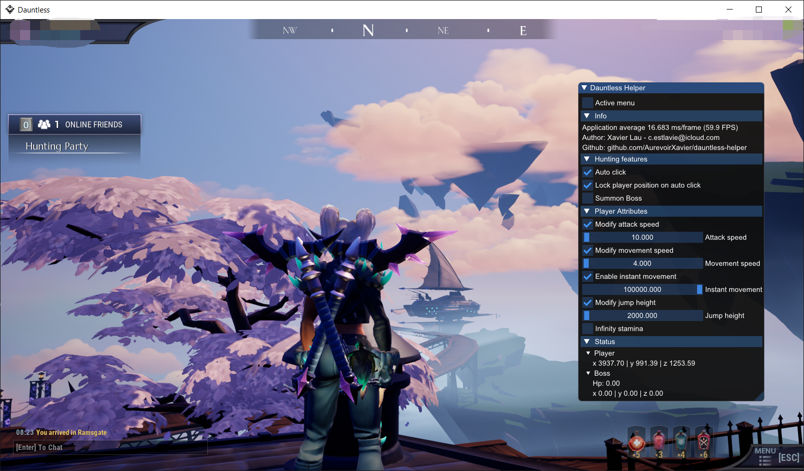

## Features

#### cpp-ver-imgui-ver

- **F1**: focus on menu - 激活菜单
- **F10**: auto farm - 自动打怪
- **Home**: show/hide menu - 显示/隐藏菜单

- **Other feature**: use **Tab** to modify the slide bar value - 使用 Tab 键可修改滑动条数值 

#### cpp-ver-FW1FontWrapper-ver (No Longer Maintained)

- **Insert**: show menu - 显示菜单
- **Hom**e: teleport to Boss - 传送 Boss
- **Delete**: attack from far - 远程攻击
- **End**: cancel the injection - 取消注入

- **Other features**: 
  1. show Boss HP - 显示 Boss 血量
  2. hunting timer - 狩猎计时
  3. speed up attack - 增加攻击速度
  4. speed up movement - 增加移动速度
  5. instant movement - 即时移动
  6. infinity stamina - 无限耐力
  7. activated by arrow keys - 方向键激活

**I post ONLY on my github. ALL FREE & USE AT YOUR OWN RISK!**
**切勿相信本人 Github 以外的任何来源. 免费 & 风险自担!**
